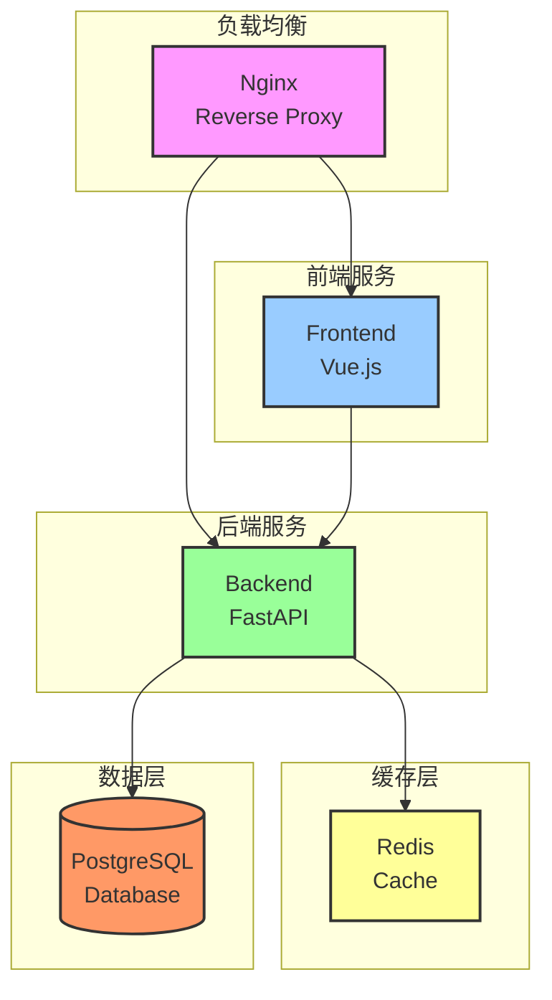

# 密钥分析系统

一个现代化的密钥分析系统，采用 Apple 设计风格的响应式界面。

## 技术栈

### 前端
- Vue 3
- TypeScript
- Naive UI
- ECharts
- Dayjs

### 后端
- Python
- FastAPI
- SQLAlchemy
- Redis
- PostgreSQL

## 系统要求

- Docker 20.10.0 或更高版本
- Docker Compose v2.0.0 或更高版本
- 4GB RAM 或更多
- 10GB 可用磁盘空间

## 快速开始

1. 克隆仓库
```bash
git clone [repository-url]
cd key-analysis
```

2. 配置环境变量
```bash
cp .env.example .env
```
编辑 .env 文件，设置必要的环境变量：
```env
# PostgreSQL 配置
POSTGRES_USER=postgres
POSTGRES_PASSWORD=your_password
POSTGRES_DB=key_analysis
POSTGRES_HOST=postgres
POSTGRES_PORT=5432

# Redis 配置
REDIS_HOST=redis
REDIS_PORT=6379
REDIS_DB=0

# 后端配置
BACKEND_SECRET_KEY=your_secret_key
BACKEND_CORS_ORIGINS=["http://localhost:5173"]
BACKEND_PORT=8000

# 前端配置
VITE_API_BASE_URL=http://localhost:8000
```

3. 启动服务
```bash
docker compose up -d
```

4. 访问应用
- 前端界面：http://localhost:5173
- API 文档：http://localhost:8000/docs

## 部署架构



## 目录结构

```
key-analysis/
├── frontend/                # 前端 Vue 应用
│   ├── src/
│   ├── Dockerfile
│   └── package.json
├── backend/                 # 后端 FastAPI 应用
│   ├── app/
│   ├── Dockerfile
│   └── requirements.txt
├── nginx/                   # Nginx 配置
│   └── nginx.conf
├── docker-compose.yml       # Docker Compose 配置
├── .env.example            # 环境变量示例
└── README.md               # 项目文档
```

## 维护指南

### 数据库备份
```bash
# 创建备份
docker compose exec postgres pg_dump -U postgres key_analysis > backup.sql

# 恢复备份
docker compose exec -T postgres psql -U postgres key_analysis < backup.sql
```

### 日志查看
```bash
# 查看所有服务日志
docker compose logs

# 查看特定服务日志
docker compose logs backend
docker compose logs frontend
```

### 更新部署
```bash
# 拉取最新代码
git pull

# 重新构建并启动服务
docker compose up -d --build
```

### 健康检查
```bash
# 检查所有服务状态
docker compose ps

# 检查后端健康状态
curl http://localhost:8000/health

# 检查 Redis 连接
docker compose exec redis redis-cli ping
```

## 性能优化

1. **Redis 缓存策略**
   - 统计数据缓存：5 分钟
   - 用户会话缓存：24 小时
   - 系统配置缓存：1 小时

2. **数据库优化**
   - 已添加必要的索引
   - 使用连接池
   - 定期 VACUUM

3. **前端优化**
   - 路由懒加载
   - 组件按需加载
   - 图片懒加载
   - 本地缓存策略

## 安全配置

1. **后端安全**
   - JWT 认证
   - CORS 配置
   - Rate Limiting
   - SQL 注入防护

2. **前端安全**
   - XSS 防护
   - CSRF 防护
   - 请求加密
   - 敏感信息保护

## 故障排除

1. **数据库连接失败**
   - 检查数据库容器状态
   - 验证环境变量配置
   - 检查网络连接

2. **Redis 连接问题**
   - 检查 Redis 容器状态
   - 验证 Redis 配置
   - 检查内存使用情况

3. **前端白屏**
   - 检查 API 地址配置
   - 查看浏览器控制台错误
   - 验证构建文件完整性

## 联系方式

如有问题，请联系系统管理员或提交 Issue。
